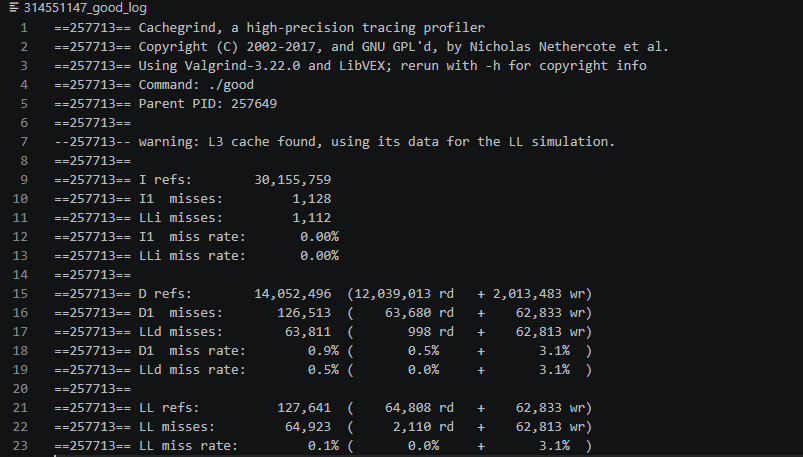
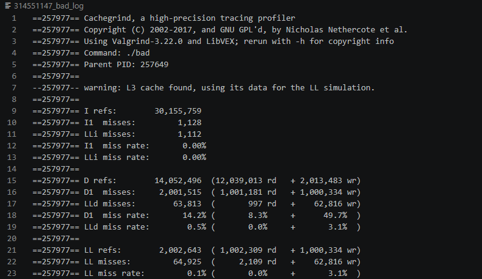
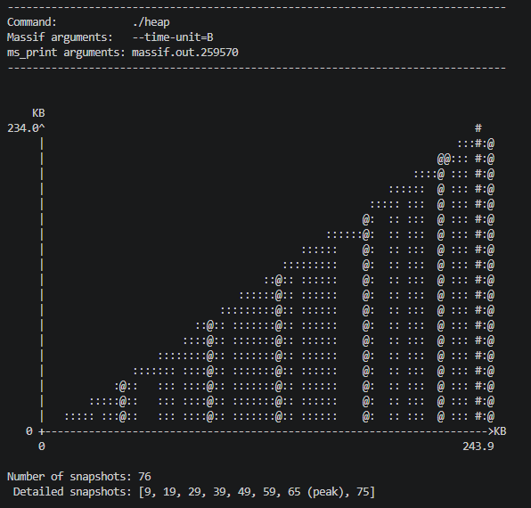
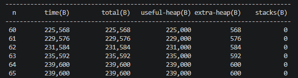
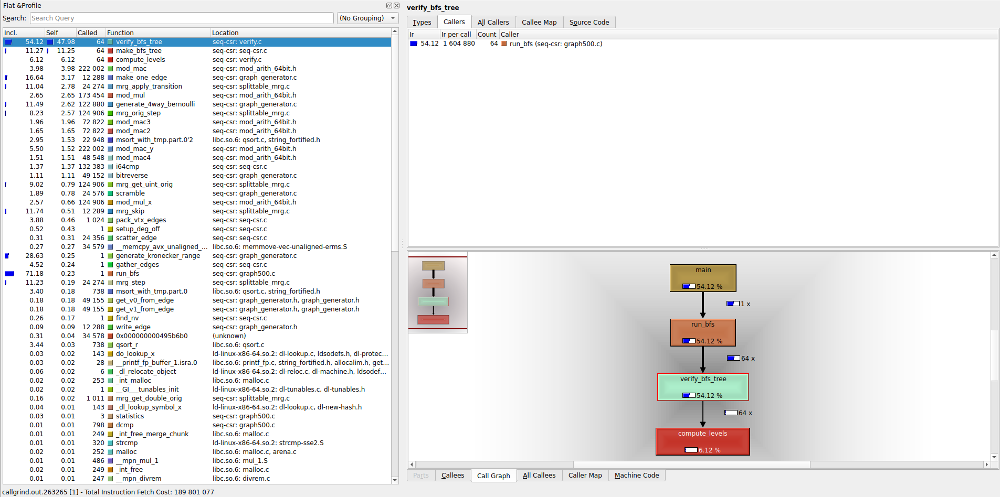
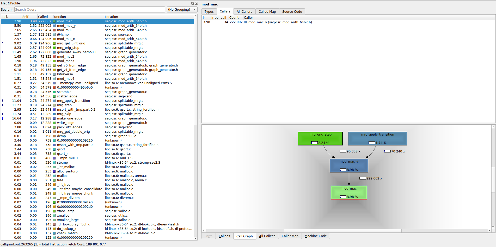
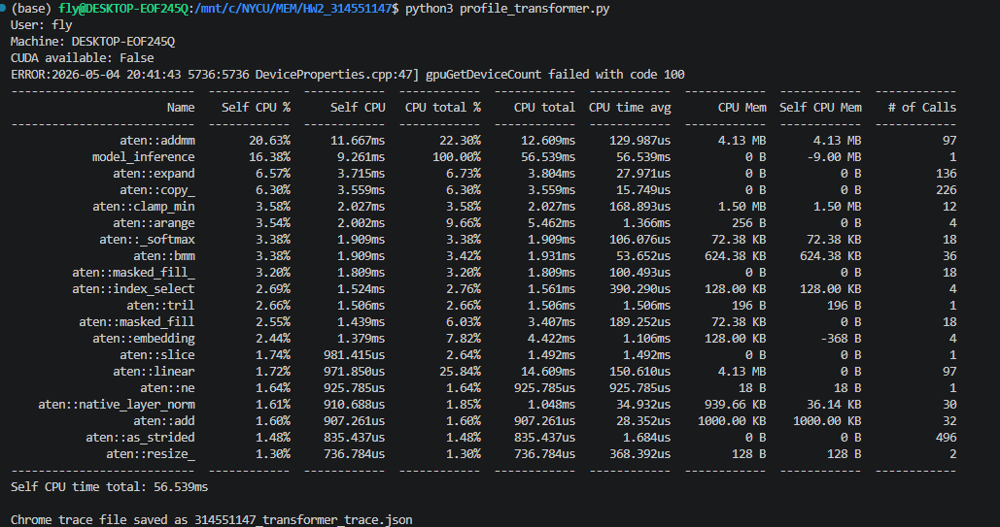
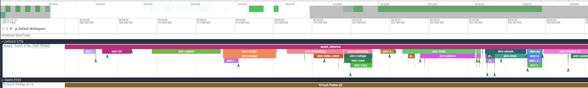

# Assignment II - Valgrind & PyTorch Profiler

**Instruction:** https://hackmd.io/Ne2HaaQIRQmw2kW6Hn9Nxg?view

---

## 1. Overview

This report presents the profiling and analysis results of Assignment II.

In this assignment, we use several profiling tools to analyze:

- Memory errors
- Cache behavior
- Heap memory usage
- Function call performance
- PyTorch model execution time

The tools used in this assignment include:

- Valgrind Memcheck
- Cachegrind
- Massif
- Callgrind
- KCachegrind
- PyTorch Profiler

Through these tools, we can better understand how programs use memory, how cache misses affect performance, which functions consume the most execution time, and which PyTorch operators take the most CPU time.

---

# 2. Questions

---

## Q1: Memcheck

### Requirement

Use Valgrind Memcheck to analyze the executable file `memleak`.

Find the major errors in the log file, annotate the log file, and explain the errors in the report.

### Command

```bash
valgrind --tool=memcheck --leak-check=full --log-file=314551147_log ./memleak
```

### Important Memcheck Log

```text
Invalid write of size 4                         ## Error 1: invalid write
    at 0x1091C0: main (memleak.c:49)
  Address 0x4a78068 is 0 bytes after a block of size 40 alloc'd
    by 0x10919E: main (memleak.c:46)

Invalid read of size 4                          ## Error 2: invalid read
    at 0x1091ED: main (memleak.c:54)
  Address 0x4a78068 is 0 bytes after a block of size 40 alloc'd
    by 0x10919E: main (memleak.c:46)

Conditional jump or move depends on uninitialised value(s)
    by 0x109214: main (memleak.c:57)             ## Error 3: uninitialized value

Use of uninitialised value of size 8
    by 0x109214: main (memleak.c:57)             ## Error 4: use of uninitialized value

Argument 'size' of function malloc has a fishy value: -40
    by 0x109220: main (memleak.c:61)             ## Error 5: fishy malloc size

Invalid free() / delete / delete[] / realloc()
    by 0x10924A: main (memleak.c:65)             ## Error 6: double free
  Address 0x4a784f0 is 0 bytes inside a block of size 40 free'd
    by 0x10923E: main (memleak.c:64)

40 bytes in 1 blocks are definitely lost         ## Additional: memory leak
    by 0x10919E: main (memleak.c:46)
```

### Answer

In the Memcheck result, I found the following major memory errors:

1. **Invalid write of size 4**  
   This error occurs at `memleak.c:49`. The program writes outside a 40-byte allocated memory block.

2. **Invalid read of size 4**  
   This error occurs at `memleak.c:54`. The program reads outside the same 40-byte allocated memory block.

3. **Conditional jump or move depends on uninitialised value(s)**  
   This error occurs at `memleak.c:57`. The program uses an uninitialized value in `printf`, causing undefined behavior.

4. **Use of uninitialised value of size 8**  
   This error also occurs at `memleak.c:57`. It is related to the same uninitialized value used during the internal number conversion of `printf`.

5. **Fishy malloc size**  
   This error occurs at `memleak.c:61`. The program passes `-40` as the size argument to `malloc`, which is an invalid or suspicious allocation size.

6. **Invalid free / double free**  
   This error occurs at `memleak.c:65`. The memory block was already freed at `memleak.c:64`, but the program tries to free it again.

### Explanation

The first two errors are caused by out-of-bounds memory access.

The program allocates only 40 bytes of memory, but it writes and reads 4 bytes immediately after this allocated block. This means the program accesses memory outside the valid range.

The third and fourth errors are caused by using an uninitialized variable. The value is passed to `printf` before being assigned, so Valgrind reports several errors related to uninitialized values.

The fifth error is caused by an invalid memory allocation size. The program calls `malloc` with a suspicious value, `-40`. Since memory allocation size should not be negative, this indicates an incorrect size calculation.

The sixth error is a double free error. The same memory block is freed twice, first at `memleak.c:64` and again at `memleak.c:65`. This may cause undefined behavior or program crashes.

In addition, the heap summary shows that **40 bytes in 1 block are definitely lost**. This means the program allocated memory at `memleak.c:46`, but did not free it before the program exited.

---

## Q2: Cachegrind

### Requirement

Use Valgrind Cachegrind to analyze the executable files `good` and `bad`.

Take screenshots of the two log files, point out the differences, and briefly explain why the difference occurs.

### Commands

```bash
valgrind --tool=cachegrind --cache-sim=yes --log-file=314551147_good_log ./good
valgrind --tool=cachegrind --cache-sim=yes --log-file=314551147_bad_log ./bad
```

### Cachegrind Output: good

```text
Command: ./good

I refs:        30,155,759
I1 misses:         1,128
LLi misses:        1,112
I1 miss rate:       0.00%
LLi miss rate:      0.00%

D refs:        14,052,496  (12,039,013 rd + 2,013,483 wr)
D1 misses:        126,513  (    63,680 rd +    62,833 wr)
LLd misses:        63,811  (       998 rd +    62,813 wr)
D1 miss rate:        0.9%  (       0.5%   +       3.1% )
LLd miss rate:       0.5%  (       0.0%   +       3.1% )

LL refs:          127,641  (    64,808 rd +    62,833 wr)
LL misses:         64,923  (     2,110 rd +    62,813 wr)
LL miss rate:        0.1%  (       0.0%   +       3.1% )
```

### Cachegrind Output: bad

```text
Command: ./bad

I refs:        30,155,759
I1 misses:         1,128
LLi misses:        1,112
I1 miss rate:       0.00%
LLi miss rate:      0.00%

D refs:        14,052,496  (12,039,013 rd + 2,013,483 wr)
D1 misses:      2,001,515  ( 1,001,181 rd + 1,000,334 wr)
LLd misses:        63,813  (       997 rd +    62,816 wr)
D1 miss rate:       14.2%  (       8.3%   +      49.7% )
LLd miss rate:       0.5%  (       0.0%   +       3.1% )

LL refs:        2,002,643  ( 1,002,309 rd + 1,000,334 wr)
LL misses:         64,925  (     2,109 rd +    62,816 wr)
LL miss rate:        0.1%  (       0.0%   +       3.1% )
```

### Answer

The main difference between `good` and `bad` is the number of L1 data cache misses.

Although both programs have the same number of instruction references and data references, `bad` has many more D1 misses than `good`.

| Program | D1 Misses | D1 Miss Rate |
|---|---:|---:|
| `good` | 126,513 | 0.9% |
| `bad` | 2,001,515 | 14.2% |

### Justification

The `bad` program has much worse L1 data cache behavior.

Its D1 miss rate is **14.2%**, while the D1 miss rate of `good` is only **0.9%**. This means `bad` accesses memory in a less cache-friendly way.

The most obvious difference is in write misses:

| Program | Write D1 Miss Rate |
|---|---:|
| `good` | 3.1% |
| `bad` | 49.7% |

This shows that nearly half of the write accesses in `bad` miss the L1 data cache.

However, their last-level cache miss rates are almost the same. Both programs have an LL miss rate of **0.1%**.

Therefore, the major performance difference is mainly caused by poor L1 data cache locality in `bad`, not by last-level cache misses.

### Screenshots





---

## Q3: Massif

### Requirement

Use Valgrind Massif to analyze the heap memory usage of `heap.c`.

Observe the relationship between time and memory allocation throughout the program execution.

Also, identify the allocated bytes and used bytes at the peak memory usage.

### Commands

```bash
gcc -o heap heap.c
valgrind --tool=massif --time-unit=B ./heap
ms_print massif.out.259570
```

### Massif Output

```text
Number of snapshots: 76
Detailed snapshots: [9, 19, 29, 39, 49, 59, 65 (peak), 75]

n        time(B)         total(B)   useful-heap(B) extra-heap(B)    stacks(B)
65       239,600         239,600    239,000        600              0
```

### Answer

According to the Massif output:

| Item | Value |
|---|---:|
| Peak snapshot | 65 |
| Peak used bytes | 239,000 bytes |
| Peak allocated bytes | 239,600 bytes |

### Explanation

The Massif graph shows the relationship between execution time and heap memory allocation.

There are 76 snapshots in total, and Massif marks snapshot 65 as the peak snapshot.

At snapshot 65:

| Field | Value |
|---|---:|
| Total allocated memory | 239,600 bytes |
| Useful heap memory | 239,000 bytes |
| Extra heap memory | 600 bytes |
| Stack memory | 0 bytes |

This means the program reaches its maximum heap usage at snapshot 65.

The useful heap represents the memory actually requested by the program, while the extra heap represents allocator overhead.

### Screenshots





---

## Q4: Callgrind

### Requirement

Use Valgrind Callgrind to analyze the Graph500 benchmark.

Then use KCachegrind to answer the following questions:

1. Which function is the most expensive in terms of self time, excluding callee functions?
2. Which function is called most frequently, and who is its caller?

### Commands

```bash
valgrind --tool=callgrind ./seq-csr/seq-csr -s 10 -e 12
kcachegrind callgrind.out.263265
```

---

## Q4-1: Which function is most expensive in terms of self time?

### Answer

The most expensive function excluding callee functions is **`verify_bfs_tree`**.

### Explanation

According to KCachegrind, `verify_bfs_tree` has the highest self cost, which is **47.98%**.

Since the question asks for the most expensive function excluding the time of callee functions, the **Self** column is used.

The call graph shows that `verify_bfs_tree` is called from `run_bfs`, and it further calls `compute_levels`.

### Screenshot



---

## Q4-2: Which function is called most frequently, and who is its caller?

### Answer

The most frequently called function is **`mod_mac`**.

It is called **222,002** times.

Its caller is **`mod_mac_y`**.

### Explanation

According to KCachegrind, `mod_mac` has the highest call count, which is **222,002**.

The Callers view shows that `mod_mac` is called by `mod_mac_y`.

The call graph also shows the calling relationship from `mod_mac_y` to `mod_mac`.

### Screenshot



---

## Q5: PyTorch Profiler

### Requirement

Use PyTorch profiler to analyze the provided Transformer model.

Only CPU execution is allowed, and CUDA should not be used.

### Profiler Command

```bash
python3 profile_transformer.py
```

---

## Q5-1: Top three functions by self CPU time

### PyTorch Profiler Table

```text
User: fly
Machine: DESKTOP-EOF245Q
CUDA available: False

Top 3 functions by self CPU time, excluding model_inference:
1. aten::addmm   - 11.667 ms (20.63%)
2. aten::expand  - 3.715 ms  (6.57%)
3. aten::copy_   - 3.559 ms  (6.30%)
```

### Answer

The top three functions in terms of self CPU time, excluding the model label, are:

1. **`aten::addmm`**
2. **`aten::expand`**
3. **`aten::copy_`**

### Explanation

According to the PyTorch profiler result, `aten::addmm` has the highest self CPU time, which is **11.667 ms** or **20.63%**.

The second highest function is `aten::expand`, with **3.715 ms** or **6.57%**.

The third highest function is `aten::copy_`, with **3.559 ms** or **6.30%**.

The function `model_inference` is not counted because it is only the outer model label.

These functions take a large amount of CPU self time because matrix multiplication, tensor expansion, and tensor copy operations are frequently used during Transformer model inference.

### Screenshot



---

## Q5-2: Chrome trace viewer

### Export Chrome Trace

```python
prof.export_chrome_trace("314551147_transformer_trace.json")
```

### Answer

The profiling result was exported to `314551147_transformer_trace.json` and visualized using a Chrome trace viewer.

Excluding the model label `model_inference`, the two functions that appear the most in terms of time are:

1. **`aten::addmm`**
2. **`aten::expand`**

### Explanation

In the trace viewer, `model_inference` represents the whole model execution, so it is not counted.

Among the internal PyTorch operators, `aten::addmm` and `aten::expand` occupy the most noticeable time blocks.

This result is also consistent with the profiler table, where `aten::addmm` has the highest self CPU time and `aten::expand` has the second highest self CPU time.

### Screenshot


